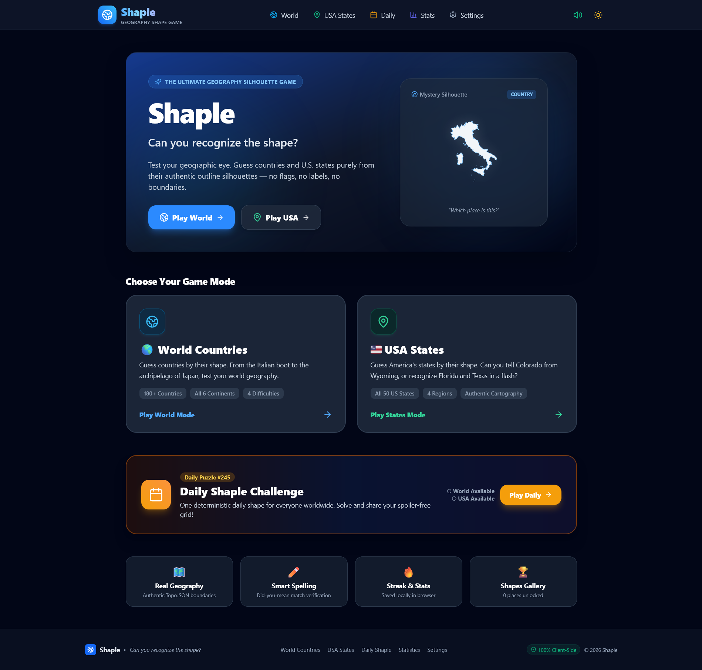

# 🌍 Shaple — Geography Shape Guessing Game

> **Can you recognize the shape?**

A client-side geography silhouette guessing game built with React, Vite, JavaScript, Tailwind CSS, Lucide React, and LocalStorage.

[](https://github.allanrozario.com/Shaple/#/)

---

## 🚀 Features

- 🌎 **World Countries Mode**: 183 internationally recognized sovereign nations with real geographic boundaries extracted from Natural Earth TopoJSON data.
- 🇺🇸 **USA States Mode**: All 50 U.S. states with authentic boundary silhouettes from U.S. Census Bureau TopoJSON data.
- 🎯 **Answer Styles**:
  - **Type Answer**: Fast search input with smart autocomplete and misspelling detection.
  - **Multiple Choice**: 4 randomized options with smart distractors from the same region.
  - **Mixed Mode**: Alternating between typed and multiple-choice questions.
- ✏️ **Fuzzy Misspelling System**:
  - Intelligent "Did you mean **X**?" confirmation dialog for typos (e.g. `Texs` -> `Texas`, `Frnace` -> `France`, `Calfornia` -> `California`, `Argntina` -> `Argentina`).
  - Correct answers confirmed after spelling errors earn +50 points.
- 💡 **3-Tier Hint System**:
  - Hint 1: Continent / Region
  - Hint 2: First Letter
  - Hint 3: Letter Count & Blank Word Pattern
- 📅 **Daily Shaple**:
  - Deterministic daily challenge based on the date.
  - Spoiler-free emoji grid sharing sheet for social media.
- 📊 **Statistics & Shape Collection Gallery**:
  - Tracks games, accuracy, streaks, perfect rounds, and average guesses.
  - Interactive silhouette gallery showcasing all unlocked countries and states with detailed trivia modals.
- 🔊 **Web Audio Synthesizer**:
  - 100% client-side procedural sound effects (no external mp3 files needed).
- ☀️🌙 **Dark & Light Modes**:
  - Responsive cartographic design optimized across mobile (320px+), tablet, and desktop viewports.
- 🔒 **100% Static & Client-Side**:
  - No backend, no API keys, no databases, works offline.

---

## 🛠️ Tech Stack

- **Framework**: React 18
- **Build Tool**: Vite
- **Language**: JavaScript (ESM)
- **Styling**: Tailwind CSS
- **Routing**: React Router (HashRouter for GitHub Pages compatibility)
- **Icons**: Lucide React
- **Celebrations**: Canvas-Confetti
- **Cartography**: TopoJSON (Natural Earth & US Atlas) projected with D3-Geo

---

## 💻 Local Development

### 1. Clone & Install
```bash
git clone https://github.com/USERNAME/Shaple.git
cd Shaple
npm install
```

### 2. Run Locally
```bash
npm run dev
```
Open your browser at `http://localhost:3000`.

### 3. Run Automated Tests
```bash
node scripts/testSuite.js
```

### 4. Build for Production
```bash
npm run build
```

---

## 🚀 Deploy to GitHub Pages

### Automatic Deployment with GitHub Actions (Recommended)
This repository includes a pre-configured GitHub Actions workflow in [`.github/workflows/deploy.yml`](.github/workflows/deploy.yml).

1. Push your repository to GitHub.
2. In your GitHub repository, go to **Settings** > **Pages**.
3. Under **Build and deployment** > **Source**, select **GitHub Actions**.
4. Every push to `main` will automatically build and publish the game to `https://USERNAME.github.io/REPOSITORY-NAME/`.

---

## 📜 Geographic Dataset Attribution

- **World Boundaries**: Natural Earth Dataset (`world-atlas` 110m & 50m TopoJSON)
- **US State Boundaries**: United States Census Bureau (`us-atlas` 10m TopoJSON)
- Projections and viewBox scaling generated using `d3-geo`.